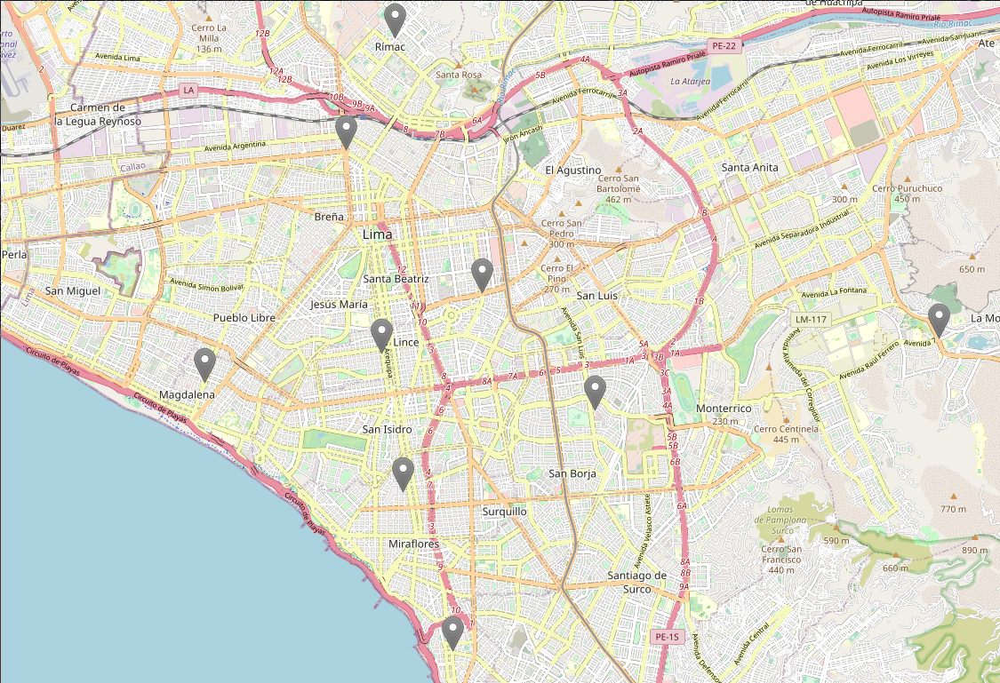

# cs3p01-proyecto

For C++ coding guidelines, see the
[C++ Core Guidelines](https://github.com/isocpp/CppCoreGuidelines).

## Requirements

### Ubuntu 18.04 LTS

Install required packages.

> On Ubuntu 16.04 LTS, omit the `clang-tools` package, which is included in the `clang` package on Ubuntu 16.04 LTS.

```bash
$ sudo apt install gcc g++ clang clang-format cmake
```

## Build

```bash
$ cd build
$ cmake ..
$ make
```

## Run

First, perform a build as described in the **Build** section, then run the following
commands in the `build` directory.

### Application

```bash
$ ./cs3p01-proyecto
```

And go to [http://0.0.0.0:8080/](http://0.0.0.0:8080/).



Then, select the subset of district you want to visit. The first will be the source and the last will be the target. 

### Unit tests

Unit tests are written using the [Catch2](https://github.com/catchorg/Catch2/) unit testing
framework.

```bash
$ ./unit_test
```

## Clang Tools

### Clang-Format

For formatting run `clang-format` on the project.

```bash
$ cd build
$ cmake ..
$ make clang-format
```
